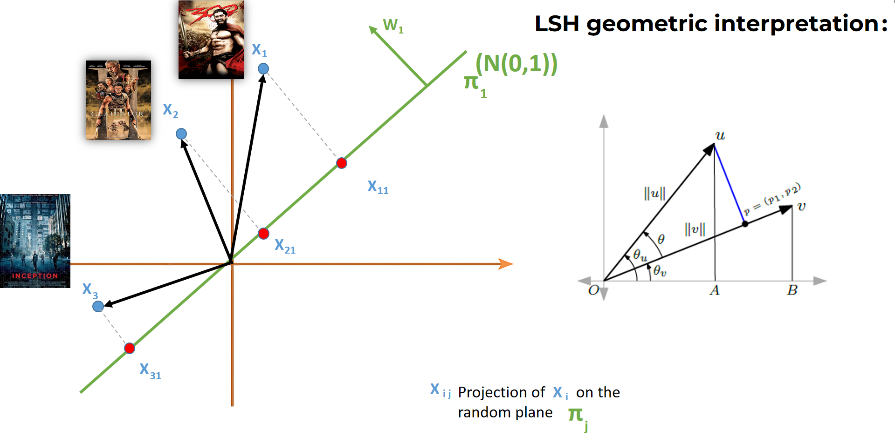

<h1>🎬 Exploring Brute Force vs. LSH Hybrid Content-Based Recommendation Systems</h1>

<h2>Overview</h2>

This project implements a <strong>content-based movie recommendation system</strong> using the <em>MovieLens</em> dataset. 
It explores two approaches:
<ul>
<li>A <strong>standard brute-force</strong> method based on cosine similarity.</li>
<li>A <strong>Locality Sensitive Hashing (LSH)</strong>-enhanced method for <strong>faster approximate similarity search</strong> using <em>Apache Spark</em>.</li>
</ul>
We analyze the trade-offs between <strong>accuracy</strong> and <strong>efficiency</strong>.

<h2>Technologies Used</h2>
<ul>
<li>Python 3.x</li>
<li>Apache Spark (PySpark)</li>
<li>Spark MLlib (<code>BucketedRandomProjectionLSH</code>)</li>
<li>Pandas</li>
<li>TMDb and OMDB APIs</li>
</ul>

<h2>Dataset</h2>

<strong>MovieLens 32M</strong> Dataset:
<ul>
<li>32 million ratings</li>
<li>200,000+ users</li>
<li>87,000+ movies</li>
</ul>
<a href="https://grouplens.org/datasets/movielens/" target="_blank">GroupLens Official Link</a>

<h2>Project Structure</h2>
<pre>
📂 main/
    ├── movies.csv
    ├── ratings.csv
    ├── CF+API.ipynb
    ├── Lsh BucketedRandomProjectionLSH.ipynb
    ├── cv_standard_rdd.ipynb
  📄 README.md

</pre>

<h2>How It Works</h2>

<h3>1. Standard Content-Based Filtering</h3>
<ul>
<li>Build movie feature vectors based on genres.</li>
<li>Construct user profiles by aggregating rated movie vectors.</li>
<li>Compute <strong>cosine similarity</strong> between user profiles and unseen movies.</li>
<li>Recommend the top N movies with the highest similarity scores.</li>
</ul>

<h3>2. LSH-Enhanced Filtering</h3>
<ul>
<li>Normalize movie and user vectors to unit length.</li>
<li>Apply <code>BucketedRandomProjectionLSH</code> to approximate similarity search.</li>
<li>Recommend movies falling into the same hash bucket, ranked by distance.</li>
</ul>

<h3>3. Visualization</h3>
<ul>
<li>Movie recommendations enriched with posters, genres, and similarity scores using the <strong>TMDb</strong> and <strong>OMDB</strong> APIs.</li>
</ul>

<h2>Results</h2>
<ul>
<li><strong>Brute-force:</strong> High accuracy, slower for large datasets.</li>
<li><strong>LSH:</strong> Much faster, minor accuracy trade-off.</li>
<li><strong>Tradeoff:</strong> Acceptable precision-recall loss vs significant computational speedup.</li>
</ul>
 
      

 
      

 
      

 
      

 
      

 
      

